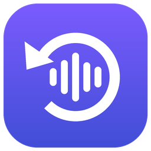

# Echodeck

Instant-replay soundboard for Discord on Windows.

Echodeck keeps the last 30 seconds of audio coming **from** Discord in memory, and only Discord's
audio: CS2, Spotify and browser audio are left out. When a friend says something funny, you can
replay it straight into the voice channel, or trim it and keep it as a clip. Your live mic keeps
working the whole time.

> **Status: Phases 1–5.**
> * Discord-only capture, with your side of the conversation mixed in
> * replay into Discord over your live mic
> * global hotkeys that work in-game
> * a soundboard library with per-clip hotkeys
> * a phone/tablet remote
> * tray mode and start-with-Windows
>
> See [docs/ARCHITECTURE.md](docs/ARCHITECTURE.md) for the design.

## Download and run (no build needed)

1. Open the repository's **Releases** page and download `Echodeck-<version>-win-x64.exe`.
2. Double-click it. That's the whole app: no installer, and no .NET install, because the runtime is
   bundled inside the exe. Settings, clips and logs go to `%AppData%\Echodeck`.
3. The exe isn't code-signed yet, so Windows SmartScreen may show "Windows protected your PC".
   Click **More info → Run anyway**.

To uninstall, delete the exe and the `%AppData%\Echodeck` folder.

### Making a release (maintainers)

The `release` GitHub Actions workflow builds the single-file exe on Windows, runs the tests, and
attaches the exe plus a `.sha256` checksum to a new GitHub Release. Start it either way:

* **From GitHub:** go to **Actions → release → Run workflow** and enter a version such as
  `0.1.0-preview.1`.
* **From git:** `git tag v0.2.0 && git push origin v0.2.0`

A version with a `-` suffix is published as a pre-release. Every normal push also uploads a test
build as a workflow artifact (open the Actions run, then **Artifacts**).

To build the same exe locally:

```powershell
dotnet publish src/Echodeck.App -p:PublishProfile=win-x64
# → artifacts/publish/win-x64/Echodeck.exe
```

## Requirements

* Windows 10 version 2004 or later, or Windows 11. This is needed for Discord-only capture; older
  versions fall back to whole-device capture.
* [.NET 8 SDK](https://dotnet.microsoft.com/download/dotnet/8.0), only if you build from source.
* Discord desktop app.
* [VB-CABLE](https://vb-audio.com/Cable/) (free) to play into Discord.

## Build from source

From a Developer PowerShell or any terminal in the repo root:

```powershell
dotnet restore
dotnet build -c Release
dotnet test
dotnet run --project src/Echodeck.App -c Release
```

In Visual Studio 2022 (17.8+): open `Echodeck.sln`, set **Echodeck.App** as the startup project and
press F5.

NuGet packages are restored automatically. To add them by hand:

```powershell
dotnet add src/Echodeck.Core  package Microsoft.Extensions.Logging.Abstractions --version 8.0.2
dotnet add src/Echodeck.Audio package NAudio --version 2.2.1
dotnet add src/Echodeck.Audio package Microsoft.Extensions.Logging.Abstractions --version 8.0.2
dotnet add src/Echodeck.App   package CommunityToolkit.Mvvm --version 8.2.2
dotnet add src/Echodeck.App   package Microsoft.Extensions.DependencyInjection --version 8.0.1
dotnet add src/Echodeck.App   package Microsoft.Extensions.Logging --version 8.0.1
dotnet add src/Echodeck.App   package Microsoft.Extensions.Logging.Debug --version 8.0.1
```

## Setting up audio (one time)

1. Install [VB-CABLE](https://vb-audio.com/Cable/): run `VBCABLE_Setup_x64.exe` as administrator, then reboot.
2. **Windows sound output: keep your headset.** Never pick a CABLE device there, or you'll hear nothing.
3. In Echodeck → **Audio** tab:
   * **Microphone:** your real mic.
   * **Send to Discord via:** `CABLE Input (VB-Audio Virtual Cable)`. This is the default when VB-CABLE is installed.
   * **Headphones for previews:** your headset.
4. In Discord → User Settings → Voice & Video:
   * **Input Device:** `CABLE Output (VB-Audio Virtual Cable)`.
   * **Output Device:** your headset.
   * Use **Voice Activity**. With Push to Talk, friends only hear clips while you hold the key.

Echodeck now carries your voice to Discord, so keep it running while you're in a call. If anything
is routed wrong, an orange or red banner at the top of the window says what's wrong and how to fix
it. It checks the devices Discord is actually using, not just Echodeck's own settings.

## Using it

### While gaming: hotkeys

Hotkeys work everywhere, even with CS2 fullscreen and Echodeck in the tray.

| Default key | Action |
|---|---|
| **F8** | Save the last N seconds as a clip (N is set on the Replay tab, default 5) |
| **F9** | Open the trim editor on the whole replay buffer. Drag the markers, then **Enter** plays the selection, **Ctrl+S** saves it |

Change these, or add stop clips / mute mic, on the **Hotkeys** tab. Each clip can also have its own hotkey, for example **Ctrl+NumPad1** for
"He's definitely B". Echodeck warns you if two actions share a key, or if another program has
already taken it.

### Phone or iPad as a soundboard

1. **Phone** tab → tick **Enable phone / tablet remote**. Allow Echodeck through Windows Firewall on
   **Private networks** when asked.
2. Scan the QR code with your phone's camera.
3. Optional: **Add to Home Screen** to use it like an app.

You get:

* **💾 Save last 5 s** and **💾 Save last 30 s**. These save from the replay buffer, including your
  side if that's on, and open the trim editor straight away.
* One tile per clip, with **🕒 Recent**, **★ Favourites** and category filters. Tap a tile to play
  it into Discord.
* A **✂** on each tile to trim the clip on the phone. Drag the handles, then preview on your
  **PC headset** or **this phone**, play the selection into **Discord**, and save, save a copy,
  rename or delete.
* Stop and Mute.

So you can save and trim mid-game without alt-tabbing. It only works on your home network, and only
for devices that scanned the QR code, which contains a secret pairing code.

### In the window

| Tab | What's there |
|---|---|
| **Replay** | 💾 Save last N s · ✂ Edit whole buffer · recent clips |
| **Soundboard** | Every clip: search, category filter, sort. Per clip: ▶ Discord, ▶ Preview (headphones only), ★ favourite, category, volume, hotkey, trim/edit, rename (F2), duplicate, delete (Del), and 📥 Import WAV/MP3 |
| **Audio** | Devices, volumes, mute, ducking, clip overlap, "include my side in replays", "hear clips in my headphones" |
| **Hotkeys** | Global shortcuts and the status of every hotkey |
| **Phone** | Remote on/off, QR code, pairing |
| **Setup** | One-time setup steps and a live routing check |
| **Settings** | Buffer length, pause recording, tray / start minimised / start with Windows, diagnostics |

Editor keys: **Space** preview · **Enter** play to Discord · **Ctrl+S** save · **Esc** cancel ·
**←/→** move the start marker · **Shift+←/→** move the end marker (hold **Ctrl** for 100 ms steps).

Replays include **both sides** of the conversation by default: your friends, plus your mic and any
clips you played. Clips you play into Discord also play in your headphones; your own mic never does.

Echodeck lives in the notification area when minimised. Right-click the icon for replay, stop,
mute and pause-recording. Only one Echodeck runs at a time; starting it again brings the window to
the front.

Clips are stored in `%AppData%\Echodeck\clips`, with metadata in `clips.json`. Logs are in
`%AppData%\Echodeck\logs`. Testing checklists are in [docs/TESTING.md](docs/TESTING.md).

## Project layout

| Project | Contents |
|---|---|
| `src/Echodeck.Core` | Platform-neutral logic: buffers, mixer, WAV, settings, clip library, hotkey model, setup rules, logging |
| `src/Echodeck.Audio` | Windows audio engine: process loopback interop, WASAPI capture and playback, devices, replay |
| `src/Echodeck.Remote` | Phone/tablet remote: small LAN web server (Kestrel) + touch soundboard page |
| `src/Echodeck.App` | WPF UI, hotkeys, tray, and the DI composition root |
| `tests/Echodeck.Core.Tests` | xUnit tests |
